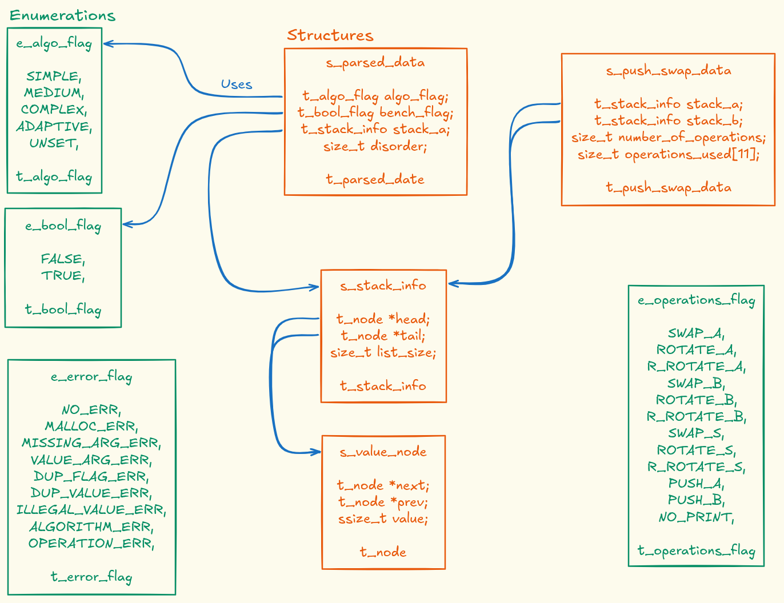
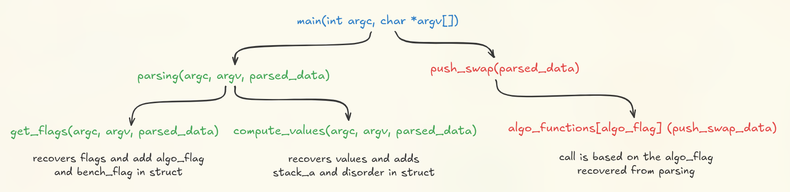

## Description

Push-swap is a group project that involves sorting a stack of integers using a limited set of operations (push, swap and rotate) and minimizing the number of moves. 

The program should be able to recover a set of flags, listed later, as well as a list of values corresponding to the starting stack, which we will call stack_a. With the help of the operations and algorithms that we coded, at the very end, all the numbers in our stack_a will be sorted, and the list of operations we deduced to solve the sorting will be printed out in the standard output.

This project allowed us to greatly improve the following skills:
- Automated compilation
- Stacks setting-up and computing
- Values sorting
- Command-line argument parsing
- Imperative programming
- Complexity analysis
- Algorithmic strategy

## Instructions

To use our Push_Swap program, clone the directory with the command :

```
git clone --recurse-submodules https://github.com/Belladone-Bzz/Push_Swap.git
```

This will download all of the project's files as well as initiate the additional libft repository. When done, go in the directory with the command `cd Push_Swap`.

The project includes a **Makefile** with the following rules:

```
make        # Compiles the project and creates push_swap executable
make all    # Same as above
make clean  # Removes object files
make fclean # Removes all generated files including executable
make re     # Recompiles the entire project from scratch
```

All source files are compiled with : `-Wall -Wextra -Werror` flags for strict error checking. To compile the project, run the `make` command in the terminal. To execute it, you can call the `push_swap` executable file and append it with your desired flags and arguments, like so :

`./push_swap --medium --bench 3 2 1 4 5 6`

## Parsing

The parsing part of the project is inside a parsing folder, containing :

- An include folder containing the header file `parsing.h`
- A src folder containing three files : `parsing.c`, `get_flags.c` and `compute_values.c`

#### Flags :
Flag(s) must be given before the values to be sorted. The first argument will therefore correspond to the name of the executable file, followed by the flag(s), and finally the int values to be sorted. 

The flags recognized by the program are as follows: `--bench`, `--simple`, `--medium`, `--complex`, and `--adaptive`.

An error message will be returned by the program if the user enters a flag that is not in the list, two identical flags, or two flags that allow an algorithm to be selected.

If no flag has been set, the program will assume that the user does not want a benchmark, and will set the algorithm to “adaptive”. This adaptive algorithm flag adapts the choice of algorithm used depending on the disorder.

#### Values : 
Regarding int values, they must therefore be entered by the user after the flags, if they are present. The program accepts either a single argument containing all int values separated only by spaces, or one argument per int value.

An error message will be returned if the above condition is not met, if anything other than a numeric value, a "+" or "-" sign is entered, or if an int value appears more than once in the input list.

This part also calculates the disorder which is a percentage between 0% and 100% that tells how far the initial stack_a is from being sorted. If the numbers are already in the right order, the disorder is 0. If they are in the worst
possible order, the disorder is 100%. Anything in between means the stack is partly sorted, but still messy.
To calculate it, we look at all the possible pairs of numbers in the stack. Each time a bigger number appears before a smaller one, that pair counts as a mistake. The more mistakes we have, the closer the disorder is to 100%.

#### Output at the end of parsing :
If no errors are detected in the user's command, all of the integer values entered by the user will be placed in a linked list and can then be processed by one of our algorithms in order to be sorted in ascending order.

## Operations

The operations module of the project is located inside its dedicated folder, containing :

- An include folder containing the header file `operations.h`
- A src folder containing the code file : `call_operations.c`

Our operations.c file contains 5 functions and allows us to perform all of the following operations:

- **sa (swap a):** *Swap the first two elements at the top of stack a. Do nothing if there is only one or no elements.*
- **sb (swap b):** *Swap the first two elements at the top of stack b. Do nothing if there is only one or no elements.*
- **ss :** *sa and sb at the same time.*
- **pa (push a):** *Take the first element at the top of b and put it at the top of a. Do nothing if b is empty.*
- **pb (push b):** *Take the first element at the top of a and put it at the top of b. Do nothing if a is empty.*
- **ra (rotate a):** *Shift up all elements of stack a by one. The first element becomes the last one.*
- **rb (rotate b):** *Shift up all elements of stack b by one. The first element becomes the last one.*
- **rr :** *ra and rb at the same time.*
- **rra (reverse rotate a):** *Shift down all elements of stack a by one. The last element becomes the first one.*
- **rrb (reverse rotate b):** *Shift down all elements of stack b by one. The last element becomes the first one.*
- **rrr :** *rra and rrb at the same time.*

## Algorithms

Sorting algorithms are often classified by their *space* complexity, or their *time* complexity. The later is the one we had to focus on for this project. It means, every moving operation (as described above) add a value to the overall complexity of the algorithm. This complexity can be divided into 3 significant number : a best case scenario (noted Ω), a worst case scenario (big O), and an average (Θ). 

The worst case is frequently used to gauge an algorithm's capacity and optimization, and most frequently integrated algorithms fall into 3 classes, where n is the number of values : an exponential time (with powers of n sorted values), a quasilinear time (of the square root of n), and a linearithmic time (based on a times log of n).

The algorithms module of the project is located inside its dedicated folder, containing :

- An include folder containing the header file `algortihms.h`
- A src folder containing the code files : `simple_algo.c`, `medium.c` and `complex.c`
- A common folder containing the code files : `algorithms_array_utils.c` and `algorithms_utils.c`

#### Simple algorithm (complexity O(n²))
We chose what became in the end a selection sort by using the benefit of having 2 stacks, pushing repeatedly the lowest value from the first stack to the second, until either the first stack is ordered, or it is left with 5 values, in which case we would call a subalgorithm function to optimize the most moves. When any of the conditions is true, all values are pushed back to the first stack, ordering them in ascending order, with an exponential complexity of square n.

#### Medium algorithm (complexity O(n√n))
Our medium algorithm consists of dividing all the values into a number of √n chunks before computing them. This takes shape as a selection sort pushing the closest value of the currently computed chunk repeatedly, until all values confined in said chunk are pushed over, and the next chunk is taken into account. When all chunks are moved over, the values are simply pushed back into the first stack by always accessing the highest value.

#### Complex algorithm (complexity O(n log n))
For the complex algorithm, we used a binary-based radix sort. By adding all the values to a temporary array and sorting them on the back-end, we recover their end-position index, which helps reduce the runtime of the sorting. Bit by bit, from right to left, any that's equal to 0 is push to the second stack, then all are grouped back to the first stack. By looping every bit, all the values are sorted with more and more precision. This algorithm is the most efficient for a high number of values, but the number of operations will be dependant to the list size rather than the disorder, and will sometimes be less performant than the other algorithms.

#### Adaptive algorithm
The adaptive algorithm choose the better strategy to sort values in the initial stack_a.
- If the list size is below 10, the simple algorithm is used.
- If the list size is between 10 and 100, the medium algorithm is used.
- If the list size is above 100 :
	- If the disorder is below 8%, the simple algorithm is used.
 	- If the disorder is between 8% and 44%, the medium algorithm is used.
 	- If the disorder is above 44%, the complex algorithm is used.

## Project's structure



We decided to use a certain amount of enumerations and structures for different modules for information transmition and code clarity.



## Resources

> [!NOTE]
No AI was used in the making of this project.

#### In order to understand the vocabulary and concepts related to algorithms, and the project requirements :
- https://www.geeksforgeeks.org/dsa/analysis-algorithms-big-o-analysis/
- https://www.geeksforgeeks.org/dsa/implement-a-stack-using-singly-linked-list/
- https://www.gibbontech.com/ecole42/push_swap/index.html

#### In order to visualize the different operations and perform sorting tests, we used different Push Swap vizualisers :
- https://vscza.itch.io/push-swap
- https://push-swap42-visualizer.vercel.app/

#### We used the following resources to conceptualize our three types of algorithms :

##### *Simple :*
- https://www.geeksforgeeks.org/dsa/selection-sort-algorithm-2/
- https://www.geeksforgeeks.org/dsa/bubble-sort-algorithm/

##### *Medium :*
- https://satyadeepmaheshwari.medium.com/sorting-large-datasets-with-limited-memory-the-chunked-merge-sort-approach-318275275c81
- https://github.com/kurval/42-push_swap

##### *Complex :* 
- https://www.w3schools.com/dsa/dsa_algo_radixsort.php
- https://www.codequoi.com/binaire-001-compter-et-calculer-comme-un-ordinateur/
- https://www.geeksforgeeks.org/c/bitwise-operators-in-c-cpp/
- https://www.geeksforgeeks.org/cpp/left-shift-right-shift-operators-c-cpp/

## Credits

- [Jolyne](https://github.com/jolyne-mangeot) :
	- Conception :
		- Shared work on the modules,
		- Project's structure (Makefile, mindmap),
		- Introduction of enumerations.
	- Programming :
		- parsing (compute_values),
		- Operations (call_operation),
		- Algorithms (medium_algo, complex_algo).
- [Belladone-Bzz](https://github.com/Belladone-Bzz) :
	- Conception :
		- Shared work on the modules,
		- Testers implementation,
		- Documentation (algorithms studied, Docstrings).
	- Programming :
		- parsing (get_flags),
		- Operations (all operations functions),
		- Algorithms (simple_algo, complex_algo).
